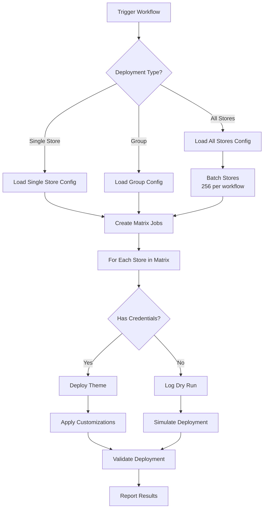

# Shopify Multi-Store Theme Management Architecture

## Overview
A scalable GitHub Actions-based system to manage themes across 1,100+ Shopify university stores, enabling centralized theme updates with selective deployment capabilities.

## System Architecture

### 1. Repository Structure
```
github-actions/
├── .github/
│   └── workflows/
│       ├── deploy-theme.yml          # Main deployment workflow
│       ├── deploy-group.yml          # Group deployment workflow
│       └── deploy-single.yml         # Single store deployment
├── theme/                            # Global master theme
│   ├── assets/
│   ├── config/
│   ├── layout/
│   ├── locales/
│   ├── sections/
│   ├── snippets/
│   └── templates/
├── config/
│   ├── stores.yml                    # All store configurations
│   ├── groups.yml                    # Store groupings
│   └── overrides/                    # Store-specific customizations
├── scripts/
│   ├── deploy.js                     # Deployment logic
│   └── validate.js                   # Theme validation
└── docs/
    └── README.md                     # Usage documentation
```

### 2. Store Configuration Format

#### stores.yml
```yaml
stores:
  university-of-california:
    shopify_url: "https://university-of-california.myshopify.com"
    credentials_secret: "UC_SHOPIFY_TOKEN"
    region: "west-coast"
    type: "large-public"
    customizations:
      - logo: "uc-logo.png"
      - primary_color: "#003262"
  
  harvard-university:
    shopify_url: "https://harvard-university.myshopify.com"
    credentials_secret: "HARVARD_SHOPIFY_TOKEN"
    region: "east-coast"
    type: "large-private"
    customizations:
      - logo: "harvard-logo.png"
      - primary_color: "#A51C30"
```

#### groups.yml
```yaml
groups:
  west-coast:
    - university-of-california
    - stanford-university
    - university-of-washington
  
  east-coast:
    - harvard-university
    - mit
    - yale-university
  
  large-public:
    - university-of-california
    - university-of-texas
    - ohio-state-university
  
  test-stores:
    - test-store-1
    - test-store-2
    - test-store-3
```

### 3. GitHub Actions Workflows

#### Main Deployment Workflow Structure
```yaml
name: Deploy Theme
on:
  workflow_dispatch:
    inputs:
      deployment_type:
        description: 'Deployment type'
        required: true
        type: choice
        options:
          - single-store
          - group
          - all-stores
      target:
        description: 'Store name or group name'
        required: false
      dry_run:
        description: 'Dry run mode'
        type: boolean
        default: true

jobs:
  deploy:
    runs-on: ubuntu-latest
    strategy:
      matrix:
        # Dynamic matrix based on input
        # Max 256 jobs per workflow (GitHub limit)
      max-parallel: 50  # Control concurrency
      fail-fast: false  # Don't stop all jobs if one fails
```

### 4. Scalability Strategy

#### Batching for 1,100+ Stores
- **GitHub Matrix Limit:** 256 jobs per workflow
- **Solution:** Create multiple workflow runs or use dynamic batching
- **Approach:** 
  - Batch 1: Stores 1-200
  - Batch 2: Stores 201-400
  - Continue until all stores processed

#### Rate Limiting Handling
- **Shopify API Limits:** 2 requests per second (REST), 1000 points per minute (GraphQL)
- **Strategy:** 
  - Add delays between requests
  - Implement exponential backoff
  - Use Shopify CLI which handles rate limiting

### 5. Secrets Management

#### For 1,100+ Stores
```yaml
# Option 1: Individual secrets (limited by GitHub)
secrets:
  STORE_001_TOKEN: "shpat_..."
  STORE_002_TOKEN: "shpat_..."
  # ... up to GitHub's limit

# Option 2: Consolidated JSON secret
secrets:
  SHOPIFY_STORE_TOKENS: |
    {
      "store-001": "shpat_...",
      "store-002": "shpat_...",
      ...
    }

# Option 3: External secrets manager
secrets:
  VAULT_URL: "https://vault.company.com"
  VAULT_TOKEN: "hvs...."
```

### 6. Prototype Implementation

#### Test Store Setup
- **Real Stores:** 3-5 Shopify development stores
- **Mock Stores:** Remaining stores simulated in config
- **Naming Convention:** 
  - `test-university-1.myshopify.com`
  - `test-university-2.myshopify.com`
  - etc.

#### Dry Run Implementation
```javascript
// In deployment script
if (isDryRun || !hasCredentials(store)) {
  console.log(`[DRY RUN] Would deploy theme to ${store.name}`);
  console.log(`[DRY RUN] Store URL: ${store.shopify_url}`);
  console.log(`[DRY RUN] Customizations: ${JSON.stringify(store.customizations)}`);
} else {
  // Actual deployment logic
  await deployTheme(store);
}
```

### 7. Deployment Flow



### 8. Error Handling & Monitoring

#### Retry Logic
- **Network Errors:** Retry with exponential backoff
- **Rate Limit Errors:** Wait and retry
- **Authentication Errors:** Fail fast and report

#### Logging Strategy
- **Success:** Store name, deployment time, theme version
- **Failure:** Store name, error message, retry attempts
- **Summary:** Total stores, success count, failure count

#### Notification Options
- **Slack Integration:** Post results to channel
- **Email Notifications:** On failures or completion
- **GitHub Issues:** Auto-create for persistent failures

### 9. Store-Specific Customizations

#### Implementation Approach
```javascript
// Pre-deployment customization injection
function applyCustomizations(theme, store) {
  if (store.customizations) {
    // Replace logo
    if (store.customizations.logo) {
      replaceAsset(theme, 'logo.png', store.customizations.logo);
    }
    
    // Update colors in CSS/settings
    if (store.customizations.primary_color) {
      updateThemeSettings(theme, 'primary_color', store.customizations.primary_color);
    }
  }
  return theme;
}
```

### 10. Performance Considerations

#### Optimization Strategies
- **Parallel Execution:** Use matrix strategy for concurrent deployments
- **Caching:** Cache theme builds between deployments
- **Incremental Updates:** Only deploy changed files when possible
- **Resource Limits:** Monitor GitHub Actions usage and costs

#### Monitoring Metrics
- **Deployment Time:** Track time per store and total time
- **Success Rate:** Monitor deployment success percentage
- **API Usage:** Track Shopify API consumption
- **GitHub Actions Usage:** Monitor minutes consumed

### 11. Security Considerations

#### Access Control
- **Repository Access:** Limit who can trigger deployments
- **Secrets Management:** Use least-privilege access
- **Audit Logging:** Track all deployment activities

#### Best Practices
- **Token Rotation:** Regular rotation of Shopify access tokens
- **Environment Separation:** Separate dev/staging/production workflows
- **Input Validation:** Validate all workflow inputs

### 12. Future Enhancements

#### Planned Features
- **Theme Versioning:** Track and rollback theme versions
- **A/B Testing:** Deploy different themes to different store groups
- **Automated Testing:** Theme validation and testing pipeline
- **Analytics Integration:** Monitor theme performance across stores
- **Self-Service Portal:** Web interface for non-technical users

---

## Quick Start Guide

### 1. Setup Development Stores
```bash
# Create Shopify Partner account
# Create 3-5 development stores
# Generate private app credentials for each
```

### 2. Configure Repository
```bash
git clone <repository>
cd github-actions
cp config/stores.example.yml config/stores.yml
# Edit stores.yml with your test stores
```

### 3. Set GitHub Secrets
```bash
# Add secrets for each test store
gh secret set TEST_STORE_1_TOKEN --body "shpat_..."
gh secret set TEST_STORE_2_TOKEN --body "shpat_..."
```

### 4. Run First Deployment
```bash
# Trigger workflow via GitHub UI or CLI
gh workflow run deploy-theme.yml \
  --field deployment_type=group \
  --field target=test-stores \
  --field dry_run=true
```

---

## Support & Troubleshooting

### Common Issues
1. **Rate Limiting:** Reduce parallel jobs or add delays
2. **Authentication Failures:** Verify token permissions
3. **Theme Validation Errors:** Check theme structure
4. **Matrix Job Limits:** Implement batching strategy

### Resources
- [Shopify CLI Documentation](https://shopify.dev/docs/themes/tools/cli)
- [GitHub Actions Matrix Strategy](https://docs.github.com/en/actions/using-jobs/using-a-matrix-for-your-jobs)
- [Shopify API Rate Limits](https://shopify.dev/docs/api/usage/rate-limits)
